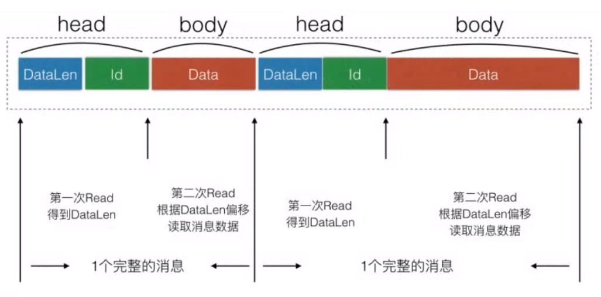

## 基于Zinx的多人在线游戏

### 项目介绍

使用Golang，基于并发服务器框架Zinx进行服务端的开发。

使用到的第三方库：

* github.com/golang/protobuf

#### 项目目录结构

* apis：用户自定义业务
  * move.go：玩家移动业务
  * world_chat.go：世界聊天业务
* client：游戏的客户端，使用C#的Unity框架编写
* conf
  * zinx.json：服务器配置文件
* pb
  * msg.proto：原始protobuf协议文件
  * build.bat：编译msg.proto的脚本文件
  * msg.pb.go：编译生成的go文件
* core：核心功能代码
  * aoi.go：AOI兴趣点算法模块
  * grid.go：网格模块
  * player.go：玩家模块
  * world_manager.go：（游戏）世界管理器模块
* main.go：服务器主入口

#### 解决TCP粘包问题

针对TCP的粘包问题，对传输的消息进行TLV格式的封包和拆包。

封包过程：

1. 先写消息内容的长度和类型
2. 再写消息的内容

拆包过程：

1. 先读取固定长度的首部，获取消息内容的长度和类型
2. 再根据消息内容的长度进行一次读写，从连接中读取消息的内容



### proto协议定义

使用protobuf作为数据传输的协议，具有较好的实时性，能够满足服务端的通信要求

具体的协议定义为：

* MsgID：1，发起者：Server，Pid：玩家ID。同步玩家本次登录的ID（用来标识玩家）, 玩家登陆之后，由Server端主动生成玩家ID发送给客户端

```protobuf
message SyncPid{
	int32 Pid=1;
}
```

* MsgID：2，发起者：Client，Content：聊天信息。玩家向世界广播发送聊天消息

```protobuf
message Talk{
	string Content=1;
}
```

* MsgID：3，发起者：Client，P：Position类型，地图的坐标点。移动的坐标数据

```protobuf
message Position{
	float X=1;
	float Y=2;
	float Z=3;
	float V=4;
}
```

* MsgID：200，发起者：Server，Pid：玩家ID，Tp：1 世界聊天、2 坐标、3 移动之后坐标信息更新。广播消息

```protobuf
message BroadCast{
	int32 Pid=1;
	int32 Tp=2;
	oneof Data {
		string Content=3;
		Position P=4;
    }
}
```

* MsgID：201，发起者：Server，Pid：玩家ID。广播消息（玩家下线）

```protobuf
message SyncPid{
	int32 Pid=1;
}
```

* MsgID：202，发起者：Server，ps：Player 集合。需要同步的玩家同步周围玩家的位置信息（包括自己）

```protobuf
message SyncPlayers{
	repeated Player ps=1;
}

message Player{
	int32 Pid=1;
	Position P=2;
}
```

### 功能实现逻辑

#### 玩家上线

给Server注册一个创建连接之后的Hook函数，当玩家上线后：

* 给连接绑定一个playerId属性，记录当前连接（当前消息）是属于哪个玩家的
* 将当前玩家的PlayerID同步给其对应的客户端
* 将当前玩家的初始位置同步给所有玩家的客户端
  * 获取当前玩家周围的玩家有哪些（九宫格）
  * 将当前玩家的位置信息根据proto协议进行封装发送给周围的玩家（让其他玩家看到自己）
  * 将周围的全部玩家的位置信息发送给当前的玩家（让自己看到其他玩家）

#### 世界聊天

新增一个世界聊天业务，具体逻辑为：

* 根据proto协议解析客户端发送的聊天消息
* 根据连接的playerId属性，得到对应的Player对象
* 将聊天的数据广播给全部在线玩家

#### 移动位置与广播

新增一个玩家移动业务，具体逻辑为：

* 根据proto协议解析得到当前玩家的位置坐标
* 得到当前发送位置的是哪个玩家
* 更新当前玩家的坐标
* 根据proto协议封装当前玩家的位置坐标
* 获取当前玩家的周围玩家，依次给每个玩家对应的客户端发送消息

#### 玩家下线 

给Server注册一个连接断开之前的Hook函数，当玩家下线前：

* 得到当前下线的是哪个玩家
* 根据proto协议封装下线通知的消息
* 获取当前玩家的周围玩家，依次给每个玩家对应的客户端发送消息
* 将当前玩家从世界管理器中删除，将当前玩家从AOI管理器中删除